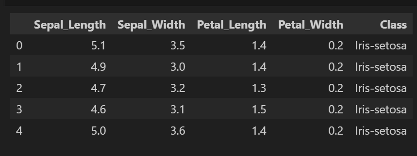
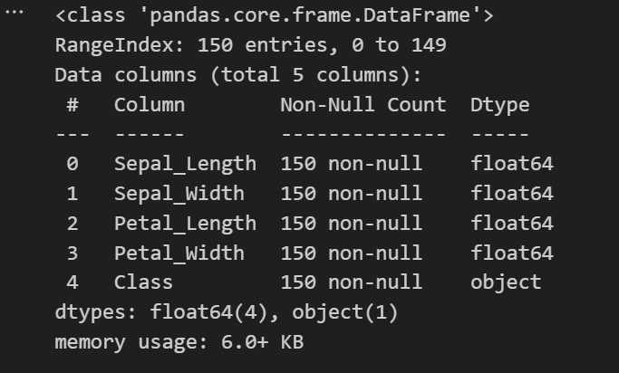
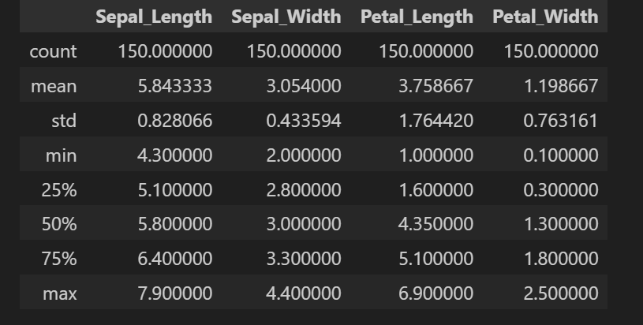
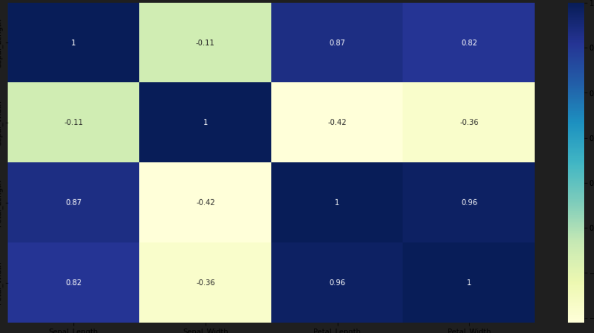
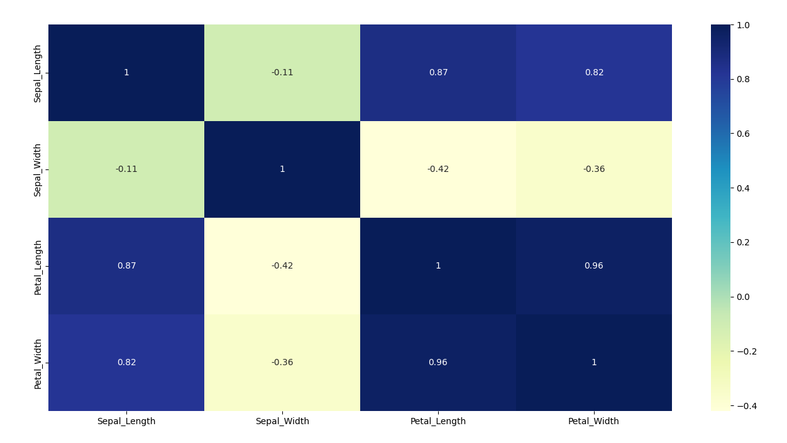
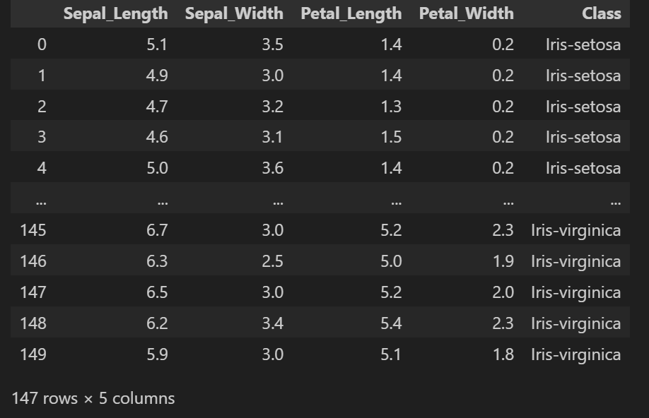

# **naive bayes classifier**
import pandas as pd

#**Loading the data**
csv_url = 'https://archive.ics.uci.edu/ml/machine-learning-databases/iris/iris.data'
col_names = ['Sepal_Length','Sepal_Width','Petal_Length','Petal_Width','Class']
iris =  pd.read_csv(csv_url, names = col_names)


**First five rows of dataframe**

First five rows of dataframe

![image_alt]https://github.com/madiha29/APR_Assignment-1/blob/be2a656bb11d69bd54cdddc404ba74d96a8b727e/image-1.png

```python
iris.head()'''


# **EDA**

**1. Shape of Dataset**
```python
iris.shape()

(2)
```python
iris.info()


(3)iris.describe()


**Visualizing using seaborn**
plt.figure(figsize=(20, 10))
sns.pairplot(iris)
plt.show()


**Showing correlation among features(non-categorical) via heatmap**


**Checking for null values in each column**
iris['Sepal_Length'].isnull().sum()
iris['Sepal_Width'].isnull().sum()

**Checking for duplicate rows**
iris.duplicated().sum()

**Counting unique values of each column**
iris.Sepal_Length.value_counts()

**Removal of duplicate rows**
iris.drop_duplicates(inplace=True)

**Final Dataset after performing EDA**


**Separation of 'Class' column and storing in variable Y and other columns in variable X.**

X=iris.loc[:,'Sepal_Length':'Petal_Width']
Y=iris.loc[:,'Class']

**Train-test split with test size=0.2**
X_train,X_test,Y_train,Y_test=train_test_split(X,Y,test_size=0.2,random_state=25)
X_train.shape,X_test.shape,Y_train.shape,Y_test.shape

**Performing training(fitting) the train data into the model and then giving the predictions.**
from sklearn.naive_bayes import GaussianNB

clf = GaussianNB()
clf.fit(X_train, Y_train)
SkTrain = clf.predict(X_train) 
SkTest = clf.predict(X_test)


**Printing the predictions**
SkTest

**Printing the accuracy score**
accuracy_score(SkTest,Y_test)
=0.8333333333333334


